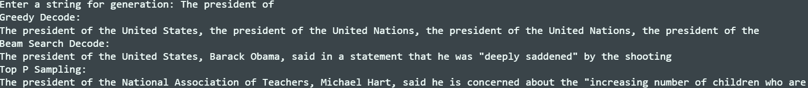
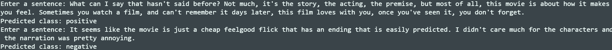
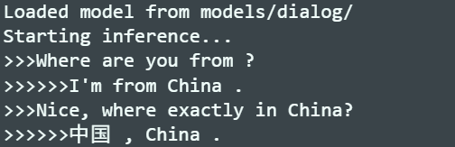

# simplGPT2

**simplGPT2** is a minimal implementation of GPT-2 in PyTorch from scratch (attention, LayerNorm, Transformer blocks), with support for importing pretrained weights and fine‑tuning on tasks like IMDB sentiment classification and DailyDialog dialogue generation.

## Features

- Manual GPT-2 components: causal multi‑head attention, LayerNorm, Feed‑Forward, residual connections
- Pretrained weight loader for HuggingFace GPT-2
- Fine‑tuning on:
  - **IMDB** (binary sentiment classification)
  - **DailyDialog** (prompt‑response dialogue bot)
- Inference with:
  - Greedy decoding
  - Beam search
  - Top‑p (nucleus) sampling

## File Structure

### `src/`

- `GPT2.py` — main GPT2 class as well as pretrained weight loader
- `transformer.py` — Transformer block implementation including manual feedforward and normalization layers
- `attention.py` — Causal multi-head self-attention module
- `generation.py` — Inference methods: greedy decoding, beam search, and top‑p sampling

### `finetune/`

- `sentiment.py` — Fine-tunes GPT‑2 on IMDB dataset for sentiment classification by adding a classification head.
- `dailydialog.py` — Fine-tunes GPT‑2 on DailyDialog dataset for dialogue generation. Supports inference directly from saved checkpoint.

### `scripts/`

- `load_IMDBsentiment.py` — Downloads IMDB sentiment dataset
- `load_dailyDialog.py` — Downloads DailyDialog dataset

### `data/`

- Contains downloaded datasets (IMDB, DailyDialog)

### `logs/`

- TensorBoard log directories for monitoring training and validation performance

### `models/`

- Saved model checkpoints after fine-tuning (e.g., `imdb_finetuned/`, `dailydialog_finetuned/`)

## Usage

### 1. Base GPT2

The `src/` folder contains the core GPT2 components, including the model, the weight loader, and the generation functions.

```bash
python src/generation.py
```

### 2. Data Download & Preparation

All data‑related scripts live in the `scripts/` folder to download and store data in the `data/` folder.

```bash
python scripts/load_IMDBsentiment.py
python scripts/load_dailyDialog.py
```

### 3. Fine tuning

The `finetune/` directory contains scripts to train, validate, and perform inference GPT2.

- Loads the base GPT‑2 weights
- Fine‑tunes on the target dataset
- Writes model checkpoints to `models/`
- Logs training metrics to TensorBoard under `logs/<task>/`
- Supports inference directly from saved checkpoint

```bash
python finetune/sentiment.py
python finetune/dailydialogue.py
```

For viewing TensorBoard logs, run

```bash
tensorboard --logdir logs/<task>
```

## Example Usage

### 1. Text Generation



### 2. Sentiment Classification



### 3. Dialogue Generation



## Training

### 1. IMDB Sentiment Classification

Model was trained on RTX 4060 laptop GPU for 4 hours and achieved test accuracy of 90.5%, at par with other similar models

### 2. DailyDialog Dialogue Generation

Model was trained on RTX 4060 laptop GPU for 30 minutes

## References & Acknowledgements

- [Attention Is All You Need](https://arxiv.org/abs/1706.03762)
- [GPT-2: Language Models are Unsupervised Multitask Learners](https://cdn.openai.com/better-language-models/language_models_are_unsupervised_multitask_learners.pdf)
- [IMDB Large Movie Review Dataset (Sentiment Analysis)](https://ai.stanford.edu/~amaas/data/sentiment/)
- [DailyDialog: A Manually Labelled Multi‑Turn Dialogue Dataset](http://yanran.li/dailydialog)
